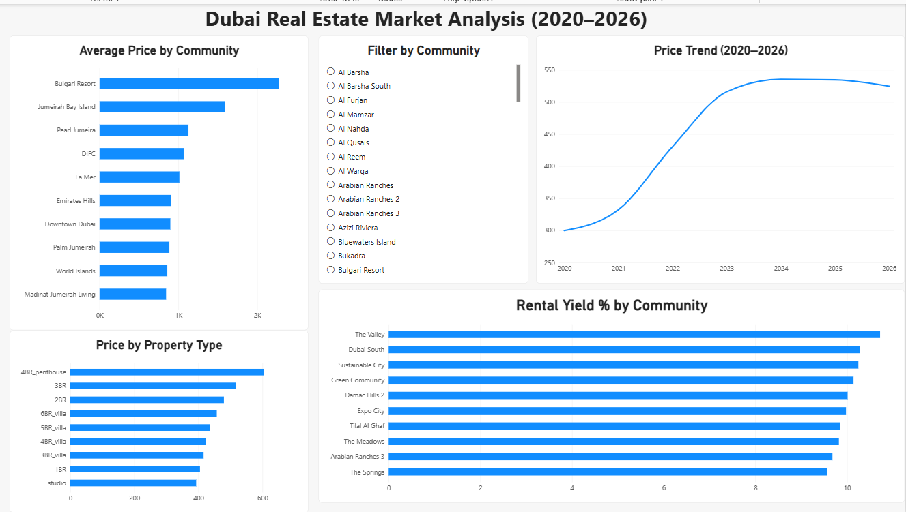

# Where Should You Actually Buy in Dubai? 

I moved to Dubai and started house-hunting (well, apartment scrolling), and kept noticing the same thing: everyone talks about which areas are "expensive" or "prestigious," but almost nobody talks about which areas are actually a *good deal* if you're thinking about buying to rent out. So I decided to find out myself.

This started as a portfolio project. It turned into me genuinely wanting to know the answer.

## The Question I Actually Wanted Answered

Not "what's the average price in Downtown Dubai" - everyone already assumes that's expensive by default. I wanted to know: **if I had money to invest in property here, where would I actually get the best return?**

## What I Found

Using 50,000+ property sale records and 25,000+ rental listings across 84 Dubai communities, I calculated **rental yield** - basically, how much rental income you'd earn per year compared to how much you'd pay to buy. It's the number that actually matters if you're investing, not just admiring a skyline view.

**The most "impressive" areas are often the worst investments:**
- Downtown Dubai, Bulgari Resort, and Jumeirah Bay Island have the highest prices and among the *lowest* rental yields (~6%)
- Meanwhile, areas like **The Valley** and **Dubai South** - not exactly Instagram famous, offer nearly double the yield (~10-11%)

In plain terms: you pay a premium to say you live somewhere fancy, but you don't necessarily earn it back in rent. If you're investing rather than showing off, the "boring" areas win.

I also found that properties near the **Red Line metro** carry a real ~10% price premium over the Green Line — which makes sense once you think about it (Downtown, Marina, DIFC all sit on Red), but I hadn't seen anyone actually quantify it before.

And yes, prices genuinely did rise ~78% between 2020 and 2024 before flattening - which lines up with real events I remember reading about (the Golden Visa changes, the post-pandemic rally), not just a random trend in the data.

## How I Got There

I didn't want this to just be "I made some pandas charts." So I made a point of:

- **Writing actual SQL** (not just pandas dressed up to look like SQL) - including a proper `JOIN` between the sales data and Dubai Metro station data, and a `RANK()` window function to see how properties stack up within their own community
- **Combining two separate datasets** (sales + rentals) to calculate yield - most analyses I saw treated these as two unrelated exercises
- **Building an interactive Power BI dashboard** so you don't have to take my word for it, you can filter by community and see it yourself

## A Note on the Data (because I checked, and you should too)

This dataset isn't scraped real transactions - it's built from real Dubai anchors (actual community locations, real Metro stations, real UAE Central Bank interest rates, and base prices anchored to Dubai Land Department and Property Finder averages) combined with a hedonic pricing model to generate realistic individual listings. That's a deliberate, documented choice by the dataset's creator - scraping real estate platforms directly violates their terms of service, so this hybrid approach is actually the more responsible way to build something shareable.

What that means practically: the *patterns* are real (the COVID dip, the 2022 rally, the 2024 cooling are all genuine, documented market events), but individual listing prices are modeled, not actual recorded sales. I wouldn't use this to price an actual apartment — but for understanding *how* Dubai's market behaves, it holds up.

*(Source: [Dubai Real Estate: Sales & Rentals (2020-2026)](https://www.kaggle.com/datasets/sergionefedov/dubai-real-estate-sales-and-rentals-20202026) on Kaggle)*

## Tools

Python (Pandas) for cleaning and exploration → SQL (SQLite) for querying → Power BI for the dashboard.

## What's in This Repo

- `dubai-real-estate-rental-yield-analysis.ipynb` — full analysis, cleaning, and SQL queries with explanations
- `Dubai_RealEstate_Dashboard.pbix` — the interactive Power BI dashboard
- `dashboard_screenshot.png` — a quick look, in case you don't have Power BI handy

## Dashboard Preview

*I'm an IT Professional based in Dubai, working across data analytics, AI tooling, and 
full-stack development*
